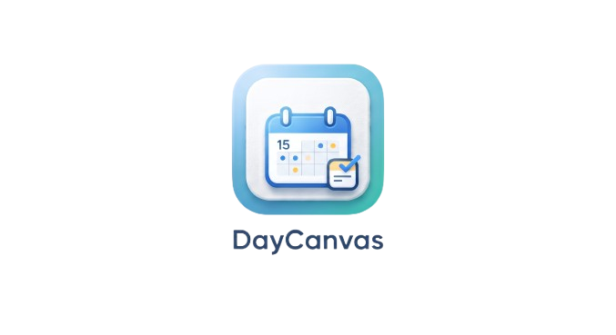

# DayCanvas

    

---

> **사용자가 편하게 메모하고, 구글 캘린더와 연동하여 일정을 효율적으로 관리하는**  
> **개인 맞춤형 일정 & 메모 캔버스 플랫폼**

---

## 배포 주소
https://day-canvas.vercel.app

---

## 목차
- [프로젝트 소개](#프로젝트-소개)
- [개발 목적](#개발-목적)
- [서비스 목표](#서비스-목표)
- [전체 기능 개요](#전체-기능-개요)
- [주요 기능](#주요-기능)
- [아키텍처 설계](#아키텍처-설계)
- [기술 스택](#기술-스택)
- [향후 확장 방향](#향후-확장-방향)
- [느낀 점](#느낀-점)

---

## 프로젝트 소개

**DayCanvas**는 사용자가 복잡한 설정 없이 간편하게 메모를 남기고, 일상적인 할 일(Todo)과 일정을 직관적인 대시보드에서 시각적으로 관리할 수 있는 **개인 생산성 플랫폼**입니다.

대중적으로 사용되는 **구글 캘린더(Google Calendar) API와의 연동**을 통해 구글 일정을 웹 내 달력에 함께 표시하여, 흩어진 일정과 메모를 하나의 캔버스 위에서 통합적으로 관리하는 사용자 경험을 제공합니다.

---

## 개발 목적

캘린더 앱과 메모장 앱이 파편화되어 있어 일정과 관련된 아이디어나 메모가 유기적으로 묶이지 못하는 불편함에서 아이디어를 얻었습니다.

DayCanvas는 사용자가 가볍고 빠르게 포스트잇처럼 메모를 생성하고, 이를 일 단위의 계획과 결합하여 한눈에 파악할 수 있도록 돕습니다. 또한 구글 캘린더와의 연동을 통해 기존의 일정을 그대로 유지한 채로 메모 기능을 덧붙일 수 있도록 구현하여, 실용적이고 직관적인 개인 일정 관리 도구를 만드는 것을 목표로 개발되었습니다.

---

## 서비스 목표
- 일정과 메모를 직관적인 포스트잇 뷰와 캘린더 뷰로 자유롭게 전환하며 관리하는 UI/UX 제공
- Supabase 기반의 가볍고 빠른 데이터 동기화 및 안정성 확보
- Google Calendar API의 실시간 연동을 통한 월별 일정 시각화
- 4대 보험 등 공제 내역을 상세 산출하는 급여 계산 기능 등 일상에 필요한 추가 도구 제공

---

## 전체 기능 개요

- 사용자 계정 관리 및 인증 (회원가입 / 로그인 / 회원탈퇴)
- 포스트잇 스타일의 메모 & 할 일(Todo) 관리
- 구글 캘린더 연동 및 월간 캘린더 일정 조회
- 월별 급여 및 4대 보험 공제 상세 계산 기능 (SalaryView)
- 1:1 사용자 문의 게시판 (InquiryBoard)

---

## 주요 기능

### 포스트잇 기반 메모 & 할 일 관리
- 간단하고 직관적인 카드(포스트잇) 형태로 메모와 할 일 정보 배치
- 마감 기한 설정, 우선순위 지정, 카테고리 태그 분류 기능 제공
- 완료 상태 및 삭제 등 편리한 상태 제어 UX 제공

### 구글 캘린더 API 연동
- 구글 OAuth 인증 정보를 활용하여 사용자의 primary 캘린더 일정 동기화
- 월간 달력 화면에서 개인 등록 일정과 구글 캘린더 일정을 통합하여 표시

### 월별 급여 관리 (SalaryView)
- 월별 총급여 정보를 입력하면 국민연금, 건강보험, 고용보험, 소득세 등 공제 내역 자동 산출
- 실수령액과 세부 공제 금액을 직관적인 표와 차트 형태로 대시보드에 제공

### 사용자 인증 및 1:1 문의
- Supabase Auth를 활용한 소셜 로그인 및 이메일 회원가입 기능
- Supabase Database 및 Realtime을 활용한 1:1 관리자 문의 게시판 제공

---

## 아키텍처 설계

- **Frontend**
  - React (Vite 기반 빌드)
  - React Query 기반 서버 상태 동기화 및 캐싱
  - Zustand 기반 전역 상태 관리 및 테마 설정
- **Backend / Database (BaaS)**
  - Supabase Auth를 통한 사용자 인증 및 세션 관리
  - Supabase PostgreSQL Database 기반 데이터 영속화
- **Third-Party API**
  - Google OAuth 2.0 & Google Calendar API 연동

---

## 기술 스택

- **Framework/Library**: React (Vite)
- **Language**: TypeScript
- **Styling**: Tailwind CSS
- **Server State**: TanStack React Query
- **Database / BaaS**: Supabase
- **Date Utility**: date-fns
- **Animation**: Framer Motion
- **HTTP Client**: Axios

---

## 향후 확장 방향

- 메모 컴포넌트의 드래그 앤 드롭 배치 상태 영구 저장
- DayCanvas 앱에서 등록한 일정이 구글 캘린더에도 즉시 등록되는 양방향 동기화 구현
- 모바일 가독성을 고려한 반응형 UI 최적화 및 오프라인 모드(PWA) 지원
- 다크 모드 및 메모 테마 커스텀 색상 기능 지원
- 알림 시스템 추가

---

## 느낀 점

DayCanvas는 처음에는 제가 개인적으로 사용할 심플한 메모장을 만들고 관리하려는 목적으로 시작한 토이 프로젝트였습니다. 하지만 개발을 진행하면서 일상에 유용한 구글 캘린더 연동, 가계부 및 급여 계산 등의 부가 기능들을 하나씩 덧붙이게 되었고, 점차 하나의 완성도 높은 일정 관리 플랫폼으로 확장되었습니다.

혼자 쓰기 위해 만든 도구였지만, 캘린더와 메모가 직관적으로 결합된 이 편리한 사용자 경험을 더 많은 사람들과 공유하고 싶다는 생각이 들어 실제 서비스 배포(Vercel)까지 도전하게 되었습니다. 

이 프로젝트를 통해 초기 기획부터 구글 API 연동, 데이터베이스 무결성 확보, 배포 및 유지보수까지 서비스 개발의 전 과정을 주도적으로 이끌어볼 수 있었습니다. 무엇보다 개인의 소박한 요구사항에서 출발한 아이디어가 실제 서비스로 거듭나는 과정을 경험하면서, 사용자 입장에서 보다 유용하고 매끄러운 UI/UX를 고민하고 구현해내는 개발자로서의 큰 보람을 느낄 수 있었습니다.
